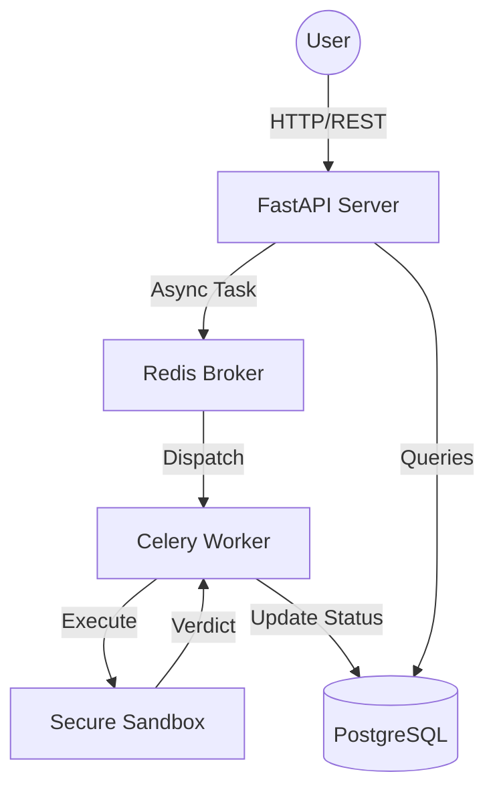

# 🚀 CodeBattle: Competitive Programming Reimagined

CodeBattle is a high-performance, containerized competitive programming platform designed for real-time 1v1 coding duels. Built with a modern tech stack, it features a robust matchmaking system, secure sandboxed execution, and an automated judging engine.

---

## 🏗️ Architecture Overview

The system is built as a distributed application consisting of several key components:

1.  **FastAPI Backend**: Orchestrates user management, problem CRUD, and matchmaking.
2.  **Celery Worker**: A background processing engine that handles code execution and judging in a secure, resource-limited sandbox.
3.  **Redis**: Acts as the message broker between the FastAPI server and the Celery workers.
4.  **PostgreSQL**: The primary database for storing users, problems, test cases, and match history.
5.  **Dynamic Sandbox**: A specialized execution environment that imposes strict resource limits (CPU/Memory/No-File) on user-submitted code to ensure system stability.



---

## 🛠️ Technology Stack

| Pillar             | Technology                                      |
| ------------------ | ----------------------------------------------- |
| **Backend**        | Python, FastAPI, SQLAlchemy                     |
| **Asynchronous**   | Celery, Redis                                   |
| **Database**       | PostgreSQL                                      |
| **Containerization** | Docker, Docker Compose                         |
| **Security**       | JWT Authentication, Subprocess Sandboxing       |
| **Languages**      | Python, JavaScript (Node.js), C++, Java         |

---

## ✨ Key Features

### 1. ⚔️ 1v1 Real-time Matchmaking
The core of CodeBattle is its matchmaking engine. Players join a queue and are matched based on their **ELO rating**. Once a match is found, both players are given the same problem to solve. The first one to pass all test cases wins.

### 2. 🛡️ Secure Code Sandbox
Every submission is executed within a controlled environment that prevents:
-   **Memory Leaks**: Restricted address space (RLIMIT_AS).
-   **Infinite Loops**: Strict CPU time limits (RLIMIT_CPU).
-   **File System Access**: Limits on the number of open files (RLIMIT_NOFILE).

### 3. 🧠 Smart Code Wrapping
CodeBattle automatically wraps user submissions to handle various input/output formats. Whether the user writes a single function or a full script, the system injects the necessary boilerplate to parse JSON inputs and validate outputs against expected results.

### 4. 📈 ELO Rating System
Winning a match earns you points (+20 ELO), while losing deducts them (-20 ELO). A global leaderboard tracks the top performers in the community.

### 5. 🛠️ Problem Management & Seeding
The platform supports a rich variety of problems with hidden and public test cases. A built-in seeding script allows for rapid deployment of a starter problem set.

---

## 📂 Project Structure

```text
CodeBattle/
├── app/
│   ├── auth.py          # JWT authentication and password hashing
│   ├── database.py      # SQLAlchemy engine and session setup
│   ├── encrypt.py       # Helper for hashing and verification
│   ├── main.py          # FastAPI routes, matchmaking logic, and API endpoints
│   ├── middleware.py    # Custom request middleware (logging/tracing)
│   ├── models.py        # SQLAlchemy database models (User, Problem, Match)
│   ├── schemas.py       # Pydantic data validation schemas
│   └── worker/
│       └── task.py      # Celery task for judging submissions in sandbox
├── migrations/          # Alembic database migration scripts
├── seed_problems.py      # Script to populate the DB with initial data
├── docker-compose.yml    # Full stack orchestration (web, worker, redis, db)
├── Dockerfile           # Backend container definition
└── PROJECT_OVERVIEW.md  # (This file) Comprehensive documentation
```

---

## 🚀 Getting Started

### 1. Prerequisites
-   Docker and Docker Compose installed.

### 2. Launch the Application
```bash
docker-compose up --build
```

### 3. Seed the Database
Once the services are running, you can populate the problem set:
```bash
docker-compose exec web python seed_problems.py
```

---

## 📡 API Endpoints

-   **Auth**: `POST /users/`, `POST /login`, `GET /me`
-   **Problems**: `GET /problems`, `POST /problems`, `PUT /problems/{id}`
-   **Matchmaking**: `POST /queue/join`, `GET /queue/status`, `DELETE /queue/leave`
-   **Competition**: `POST /match/{id}/submit`, `GET /match/{id}/result/{user_id}`
-   **Leaderboard**: `GET /leaderboard`

---

> [!TIP]
> Use the **Practice Mode** (`POST /practice/{problem_id}/submit`) to test your code against problems without affecting your ELO rating!

---

Created with ❤️ by the CodeBattle Team.
